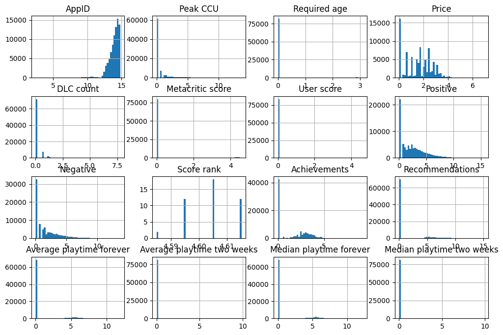
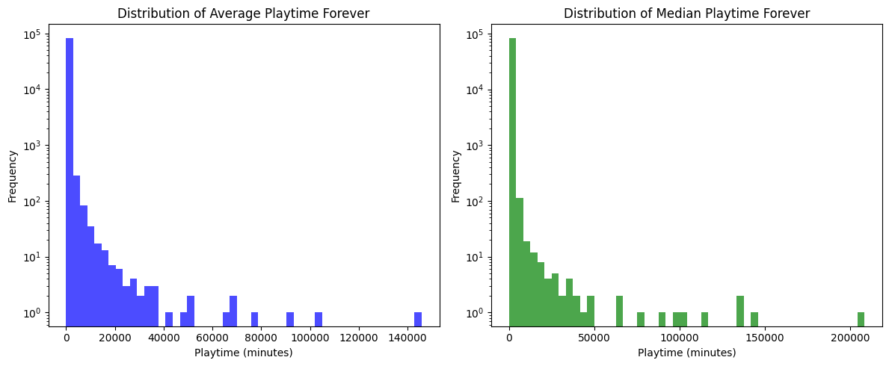
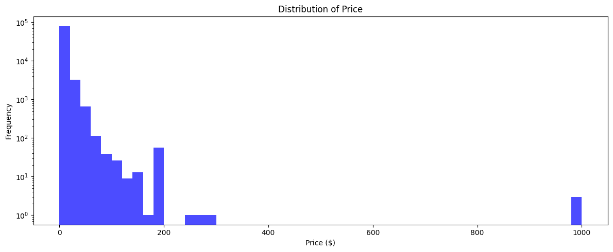
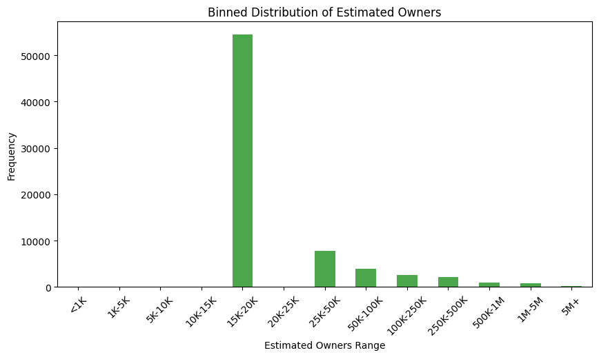
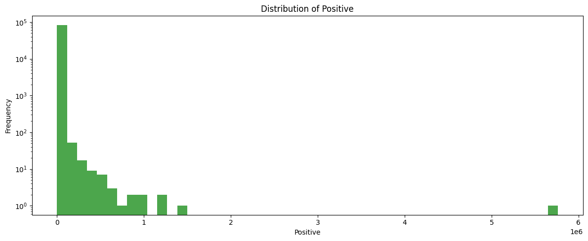
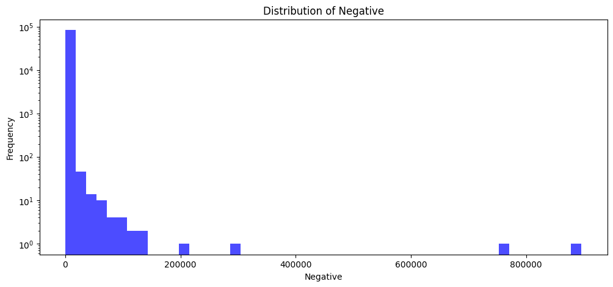
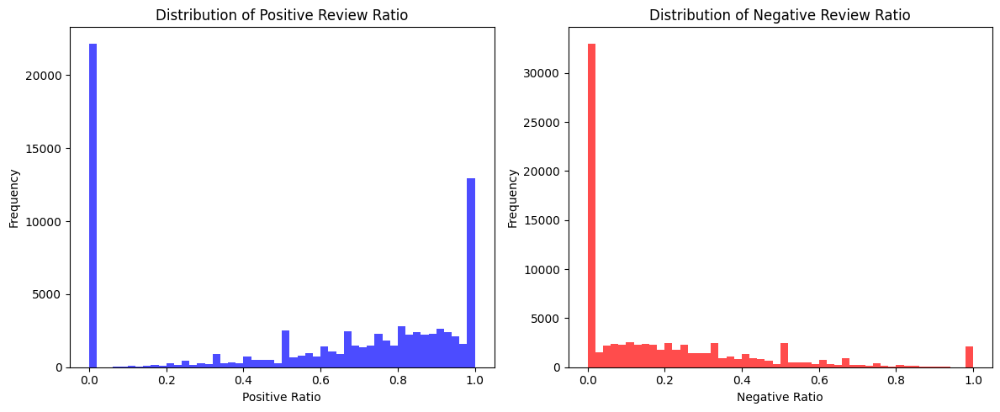
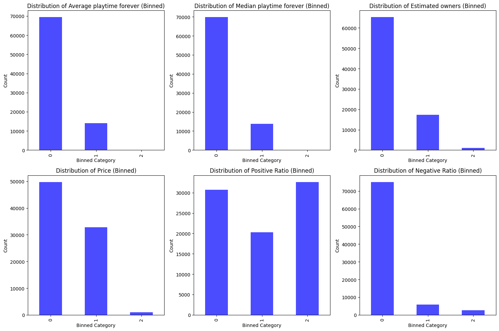
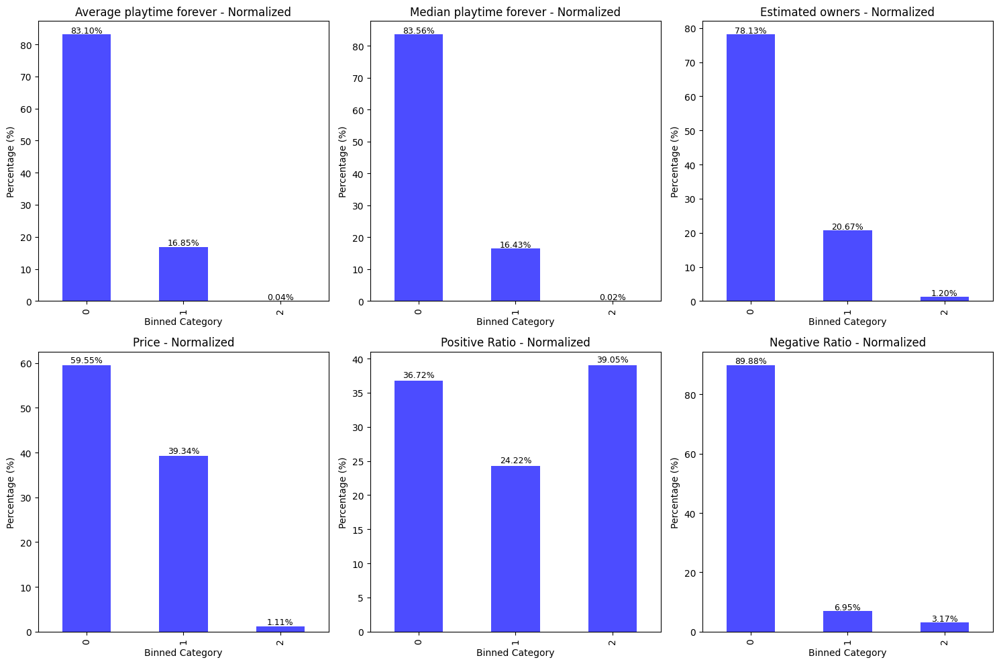

# CSE-150A-Project
Project repo for CSE 150A UCSD

[project doc link](https://docs.google.com/document/d/1n2NGoFP0WyeBzH93NpSXHTS5plMKLW4fhkT-MNVdAHw/edit?usp=sharing)

[dataset link](https://huggingface.co/datasets/FronkonGames/steam-games-dataset)


# Milestone 2 Update

---

# **Bayesian Network AI Agent for Predicting Game Popularity & Pricing**  

## **Overview**  
This project implements a **Bayesian Network AI Agent** to analyze and predict key aspects of a **new game's success** based on historical data. The model is trained on **Steam game data** and leverages **probabilistic inference** to predict:  

- **Game Popularity** (Average & Median Playtime)  
- **Optimal Pricing**  
- **Estimated Number of Owners**  

The AI agent follows a **probabilistic approach** using **Conditional Probability Tables (CPTs)** and **Bayesian Inference** to model relationships between **developers, publishers, pricing, playtime, and ownership trends**.  

---

## **Dataset**  
The dataset is sourced from [Hugging Face](https://huggingface.co/datasets/FronkonGames/steam-games-dataset) and contains information on over **83,000+** Steam games, including:  
✅ **Game Metadata** – Developer, Publisher 
✅ **Market Data** – Price, Owners, Revenue  
✅ **Engagement Metrics** – Average & Median Playtime
✅ **User Reviews** – Positive and Negative Ratings  

---
# Cleanup Section: Data Overview & Visualizations

## Column Information & Summary Statistics

### Column Information

|                            | Column Name                | Data Type   |   Non-Null Count |   Unique Count |
|----------------------------|----------------------------|-------------|------------------|----------------|
| AppID                      | AppID                      | int64       | 83560            | 83560          |
| Name                       | Name                       | object      | 83554            | 82842          |
| Release date               | Release date               | object      | 83560            | 4431           |
| Estimated owners           | Estimated owners           | object      | 83560            | 14             |
| Peak CCU                   | Peak CCU                   | int64       | 83560            | 1435           |
| Required age               | Required age               | int64       | 83560            | 19             |
| Price                      | Price                      | float64     | 83560            | 574            |
| DLC count                  | DLC count                  | int64       | 83560            | 95             |
| About the game             | About the game             | object      | 80123            | 79697          |
| Supported languages        | Supported languages        | object      | 83560            | 11130          |
| Full audio languages       | Full audio languages       | object      | 83560            | 2205           |
| Reviews                    | Reviews                    | object      | 9716             | 9619           |
| Header image               | Header image               | object      | 83560            | 83451          |
| Website                    | Website                    | object      | 39054            | 31891          |
| Support url                | Support url                | object      | 41016            | 26941          |
| Support email              | Support email              | object      | 70241            | 41334          |
| Windows                    | Windows                    | bool        | 83560            | 2              |
| Mac                        | Mac                        | bool        | 83560            | 2              |
| Linux                      | Linux                      | bool        | 83560            | 2              |
| Metacritic score           | Metacritic score           | int64       | 83560            | 73             |
| Metacritic url             | Metacritic url             | object      | 3910             | 3812           |
| User score                 | User score                 | int64       | 83560            | 33             |
| Positive                   | Positive                   | int64       | 83560            | 4531           |
| Negative                   | Negative                   | int64       | 83560            | 2302           |
| Score rank                 | Score rank                 | float64     | 44               | 4              |
| Achievements               | Achievements               | int64       | 83560            | 431            |
| Recommendations            | Recommendations            | int64       | 83560            | 4034           |
| Notes                      | Notes                      | object      | 12715            | 10318          |
| Average playtime forever   | Average playtime forever   | int64       | 83560            | 2209           |
| Average playtime two weeks | Average playtime two weeks | int64       | 83560            | 779            |
| Median playtime forever    | Median playtime forever    | int64       | 83560            | 1896           |
| Median playtime two weeks  | Median playtime two weeks  | int64       | 83560            | 782            |
| Developers                 | Developers                 | object      | 80103            | 48989          |
| Publishers                 | Publishers                 | object      | 79855            | 42571          |
| Categories                 | Categories                 | object      | 79104            | 5621           |
| Genres                     | Genres                     | object      | 80135            | 2445           |
| Tags                       | Tags                       | object      | 63574            | 56674          |
| Screenshots                | Screenshots                | object      | 81634            | 81525          |
| Movies                     | Movies                     | object      | 77260            | 77189          |

**Total Observations (Games):** 83560  
**Total Features:** 39  
**Duplicate Rows:** 0  
**Unique AppIDs:** 83560  

### Summary Statistics for Key Numerical Features

|       |            AppID |   Peak CCU |   Required age |       Price |    DLC count |   Metacritic score |    User score |        Positive |   Negative |   Score rank |   Achievements |   Recommendations |   Average playtime forever |   Average playtime two weeks |   Median playtime forever |   Median playtime two weeks |
|-------|------------------|------------|----------------|-------------|--------------|--------------------|---------------|-----------------|------------|--------------|----------------|-------------------|----------------------------|------------------------------|---------------------------|-----------------------------|
| count | 83560            | 83560      | 83560          | 83560       | 83560        | 83560              | 83560         | 83560           | 83560      | 44           | 83560          | 83560             | 83560                      | 83560                        | 83560                     | 83560                       |
| mean  | 1.33406e+06      | 136.255    | 0.316563       | 7.19532     | 0.551795     | 3.40827            | 0.0405577     | 976.05          | 162.522    | 98.9091      | 20.0838        | 789.425           | 106.641                    | 10.8549                      | 95.0166                   | 11.6565                     |
| std   | 681441           | 5450.78    | 2.26797        | 12.3123     | 13.8469      | 15.5519            | 1.80747       | 24582.7         | 4616.33    | 0.857747     | 172.999        | 18057.4           | 1152.85                    | 190.54                       | 1524.56                   | 207.227                     |
| min   | 10               | 0          | 0              | 0           | 0            | 0                  | 0             | 0               | 0          | 97           | 0              | 0                 | 0                          | 0                            | 0                         | 0                           |
| 25%   | 763045           | 0          | 0              | 0.99        | 0            | 0                  | 0             | 0               | 0          | 98           | 0              | 0                 | 0                          | 0                            | 0                         | 0                           |
| 50%   | 1.30416e+06      | 0          | 0              | 4.49        | 0            | 0                  | 0             | 7               | 2          | 99           | 0              | 0                 | 0                          | 0                            | 0                         | 0                           |
| 75%   | 1.88699e+06      | 1          | 0              | 9.99        | 0            | 0                  | 0             | 47              | 14         | 100          | 18             | 0                 | 0                          | 0                            | 0                         | 0                           |
| max   | 2.7197e+06       | 872138     | 21             | 999.98      | 2366         | 97                 | 100           | 5.76442e+06    | 895978     | 100          | 9821           | 3.44159e+06       | 145727                     | 19159                        | 208473                    | 19159                       |

And for the properties we focus on:

|       |   Average playtime forever |   Median playtime forever |   Estimated owners |       Price |        Positive |   Negative |   Positive Ratio |   Negative Ratio |
|-------|----------------------------:|--------------------------:|-------------------:|------------:|----------------:|-----------:|-----------------:|-----------------:|
| count | 83560                     | 83560                   | 83560             | 83560       | 83560           | 83560      | 83560            | 83560            |
| mean  | 106.641                   | 95.0166                 | 124017            | 7.19532     | 976.05          | 162.522    | 0.569538         | 0.190479         |
| std   | 1152.85                   | 1524.56                 | 1.41561e+06       | 12.3123     | 24582.7         | 4616.33    | 0.385809         | 0.240582         |
| min   | 0                         | 0                       | 0                 | 0           | 0               | 0          | 0                | 0                |
| 25%   | 0                         | 0                       | 20000             | 0.99        | 0               | 0          | 0                | 0                |
| 50%   | 0                         | 0                       | 20000             | 4.49        | 7               | 2          | 0.705882         | 0.1              |
| 75%   | 0                         | 0                       | 20000             | 9.99        | 47              | 14         | 0.905405         | 0.306166         |
| max   | 145727                    | 208473                  | 2e+08             | 999.98      | 5.76442e+06     | 895978     | 1                | 1                |

## Visualizing Key Distributions











## Data Cleanup Process and Feature Selection

In our project, we follow a systematic approach to clean the data and select the most relevant features for building our predictive model. The following steps outline the process, as illustrated in the accompanying images:

### 1. Initial Data Inspection

- **Column Overview:**  
  We start by reviewing the dataset’s columns—checking data types, non-null counts, and unique counts. This step helps identify issues such as missing values or redundant columns.  
  *Example:* The summary table shows that while some columns (like `AppID` and `Price`) are well-populated, others might have missing or excessive unique values that may not be useful for modeling.

- **Summary Statistics:**  
  By examining the summary statistics (mean, median, std, min, max), we get a sense of the distribution of key numerical features. This helps in spotting outliers and skewed data.

### 2. Handling Missing and Noisy Data

- **Missing Values:**  
  Columns with missing values are carefully examined. Depending on the extent of missing data, we might:
  - **Impute:** Replace missing values with mean, median, or another statistical measure.
  - **Drop:** Exclude columns that are mostly missing or irrelevant.
  
- **Noisy Data:**  
  We also identify columns with excessive noise (for example, unstructured text fields such as "About the game"). These are either cleaned further or excluded from the modeling process if they do not add significant predictive power.

### 3. Feature Engineering: Normalization and Binning

- **Normalization:**  
  Visualizing the distributions (using histograms) helps us understand the scale and spread of features like `Price`, `Average playtime forever`, and `Median playtime forever`. Normalization ensures that features are on comparable scales, which is important for many modeling techniques.

- **Binning:**  
  To simplify continuous variables, we convert them into discrete categories or bins. For instance:
  - **Price** might be binned into:
    - **Bin 0 (Low):** $0–$5  
    - **Bin 1 (Medium):** $5–$40  
    - **Bin 2 (High):** $40+  
  - Similarly, playtime values are grouped into bins (e.g., low, medium, high).  
  Binning helps reduce the complexity of the data and facilitates the construction of Conditional Probability Tables (CPTs) for our Bayesian Network.

- **Visualization:**  
  Normalized bar charts (displaying percentages rather than raw counts) are used to visualize the distribution of these binned values. This step makes it easier to compare features that have vastly different scales and understand the proportion of data in each bin.

### 4. Selecting Relevant Features

- **Key Features for Learning:**  
  Based on our data inspection and feature engineering steps, we focus on features that have both statistical significance and domain relevance:
  - **Average Playtime Forever & Median Playtime Forever:** Indicators of long-term user engagement.
  - **Estimated Owners:** Reflects the popularity and reach of the game.
  - **Price:** A critical factor in market positioning.
  - **Positive and Negative Review Ratios:** Provide insight into user sentiment and overall satisfaction.
  
- **Exclusion of Irrelevant Data:**  
  Features that are too noisy or unstructured (e.g., detailed text descriptions, website URLs) are excluded to reduce complexity and noise in the model.


---

### **🔹 AI Agent with Bayesian Inference**  
The AI agent performs **probabilistic queries** to predict the **most likely outcome** for a new game.  

**Example:**  
💡 *Predicting the price of the next game by Valve*  
```python
# Initialize the Bayesian Model
bayesian_model = BayesianNetworkModel(percent=0.8)

# Predict the most probable price category for the next Valve game
developer_name = "Valve"
publisher_name = "Valve"

predicted_price = bayesian_model.get_probability(developer_name, publisher_name)
print(f"Predicted price category: {predicted_price}")
```
➡️ **Output:** `"Most probable price category: 1 (Medium, $5 - $40)"`

---

## **Functions Implemented**

### **1️⃣ Conditional Probability Estimation**
```python
def Get_CPT_Avg_Median(self):
def Get_CPT_Price(self):
def Get_CPT_Estimated_Owners(self):
```
📌 Computes **normalized probability tables** based on past data.

---

### **2️⃣ Querying the Model**
```python
def get_probability(self, Developers, Publishers):
```
📌 Returns **most probable playtime, price, and estimated owners** for a new game.

---

### **3️⃣ Interpreting Binned Values**
```python
def get_range_description(column_name, bin_value):
```
📌 Converts **0,1,2** bins into **human-readable ranges.**

Example:
```python
print(get_range_description("Price", 2))  # Output: "$40+"
```

---

### **4️⃣ Finding the Most Likely Category**
```python
def get_most_probable_category(distribution):
```
📌 Given a **list of probabilities**, returns the **most likely outcome**.

Example:
```python
prob_list = [0.8, 0.1, 0.1]
print(get_most_probable_category(prob_list))  # Output: 0 (Low)
```

---

## **Evaluation & Next Steps**

### ✅ **Current Achievements**
🔹 **Fully implemented Bayesian Network**  
🔹 **CPTs computed & stored efficiently**  
🔹 **Model can predict price, playtime, and ownership trends**  
🔹 **Interpretable binning strategy applied to numerical values**  

### 🔜 **Future Improvements**
🔹 **Optimize inference speed** (Currently queries are direct CPT lookups)  
🔹 **Add online learning** (Update CPTs dynamically with new games)  
🔹 **Incorporate deep learning** (Use Bayesian Neural Networks)  

---

## **How to Run**
### **🔹 Step 1: Install Requirements**
```bash
pip install pandas numpy
```

### **🔹 Step 2: Run the Model**
```python
from bayesian_model import BayesianNetworkModel

# Initialize model
model = BayesianNetworkModel(percent=0.8)

# Predict next Valve game price
print(model.get_probability("Valve", "Valve"))
```

---

## Conclusion

The Bayesian Network AI Agent offers a robust and interpretable probabilistic framework for predicting key aspects of a new game's success, including playtime metrics, pricing strategy, and estimated ownership. By leveraging historical data from over 83,000 Steam games, the model constructs Conditional Probability Tables (CPTs) to capture the nuanced relationships between developers, publishers, playtime, price, and ownership.

Key achievements of the project include:

- **Probabilistic Modeling:** A clear, step-by-step Bayesian inference process that starts with developers and publishers to predict playtime, which in turn informs pricing and ultimately the estimated number of owners.
- **Data Simplification:** A manual binning strategy that transforms continuous variables into three meaningful categories, enhancing interpretability.
- **Efficient Inference:** Direct CPT lookups ensure that the model provides quick, interpretable predictions for new games.
- **Actionable Insights:** The agent aids game developers and analysts in making data-driven decisions regarding pricing and marketing strategies.

Looking ahead, potential improvements include:

- **Optimization of Inference Speed:** Further streamlining the CPT lookup process to handle larger datasets efficiently.
- **Dynamic Online Learning:** Updating the CPTs in real-time as new game data becomes available.

Overall, this Bayesian Network AI Agent serves as a strong foundation for predictive analytics in the gaming industry, demonstrating both practical applicability and significant room for future enhancement.


## Equations Used in the Project

### Bayesian Inference Equations

1. **Bayes’ Theorem:**  
   $$ 
   P(A|B) = \frac{P(B|A) \cdot P(A)}{P(B)} 
   $$

2. **Joint Probability Distribution:**  
   $$ 
   P(Playtime, Price, Owners, Revenue) = P(Developers, Publishers) \times P(Playtime|Developers, Publishers) \times P(Price|Playtime) \times P(Owners|Price) \times P(Revenue|Price, Owners) 
   $$

3. **Conditional Probability Calculation:**  
   For example, to compute the probability of a playtime bin given a developer and publisher:  
   $$ 
   P(\text{Playtime} = \text{bin}_i \mid \text{Developer} = d, \text{Publisher} 
   = p) = \frac{\text{Count}(\text{bin}_i, d, p)}{\sum_{j}\text{Count}(\text{bin}_j, d, p)} 
   $$

### Evaluation Metrics Equations

1. **Mean Absolute Error (MAE):**  
   $$ 
   MAE = \frac{1}{n} \sum_{i=1}^{n} \left| y_i - \hat{y}_i \right| 
   $$

2. **Root Mean Squared Error (RMSE):**  
   $$ 
   RMSE = \sqrt{\frac{1}{n} \sum_{i=1}^{n} \left( y_i - \hat{y}_i \right)^2} 
   $$

3. **Accuracy:**  
   Accuracy is calculated as the percentage of correct predictions among all predictions:
   $$ 
   Accuracy = \frac{\text{Number of Correct Predictions}}{\text{Total Predictions}} \times 100\% 
   $$


## Evaluation Results

### Price Metrics

- **Price Accuracy:** 0.60

**Price Confusion Matrix:**

| Actual \ Predicted |   0  |   1  |   2  |
|--------------------|------|------|------|
| **0**              | 213  | 32   | 0    |
| **1**              | 121  | 30   | 0    |
| **2**              | 7    | 2    | 0    |


---

### Owners Metrics

- **Owners Accuracy:** 0.7679012345679013

**Owners Confusion Matrix:**

| Actual \ Predicted |   0  |   1  |   2  |
|--------------------|------|------|------|
| **0**              | 311  | 0    | 0    |
| **1**              | 89   | 0    | 0    |
| **2**              | 5    | 0    | 0    |


